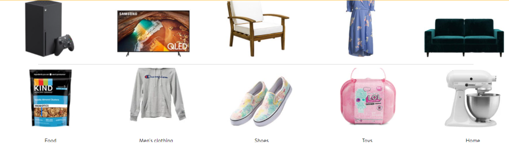
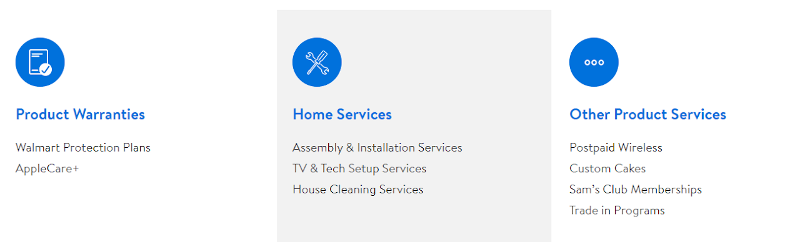

# Walmart Online Shopping

### Up to 65% off Flash Picks 
### hurry & shop top weekly finds for a limited time only !

Walmart is an American multinational retail corporation founded on 2 July 1962 that operates a chain of hypermarkets, discount department stores, and grocery stores from the United States, headquartered in Bentonville, Arkansas. Shop grocery, clothes, electronics, and much more from Walmart and save more on your every purchase. Walmart Online Shopping helps the customers shop their desired product from sitting at their place without having need to visit the offline store.

## Walmart Online Shopping
**Shop online at Walmart.com with confidence and ease.**

* Create or sign into your Walmart Online Shopping account.
* Find the item(s) you wish to order using the Search bar or select a department from the navigation box on the left side of the home screen
* Add your item(s) to the cart
* Review your cart by selecting the Cart icon in the upper-right corner of any Walmart page or select View Cart after adding an item to your cart
* From your cart you can edit item quantities, remove items, or save them for a future purchase
* When you're satisfied with the items in your cart, select Check Out
* Select a saved shipping address or add a new address
* Choose the shipping speed for your items based on the arrival dates shown
* Select or enter your preferred payment method
* Review and select Place Order to complete your order

## How to Order Groceries from Walmart Online for Pickup or Delivery ?
**To shop using the Walmart Online Shopping Grocery app, follow these instructions:**

* Sign in to the Walmart Grocery app or Get started to create an account.
* Add your email and password. Tap Sign In.
* At the top of the app, select Pickup from and choose a local store for pickup.
* Tap Select Times to reserve a date and time for pickup.
* If available, you can also select a delivery date and time. Use Search to find items to pickup or have delivered.
* On each item, tap Add+ to add to your list. Use the - and + to change the quantity.
* Tap the total at the top right to go to check out.
* Select Check Out. Choose or add payment method. Add card security code, if necessary, tap OK.
* Follow additional requirements, if necessary.
